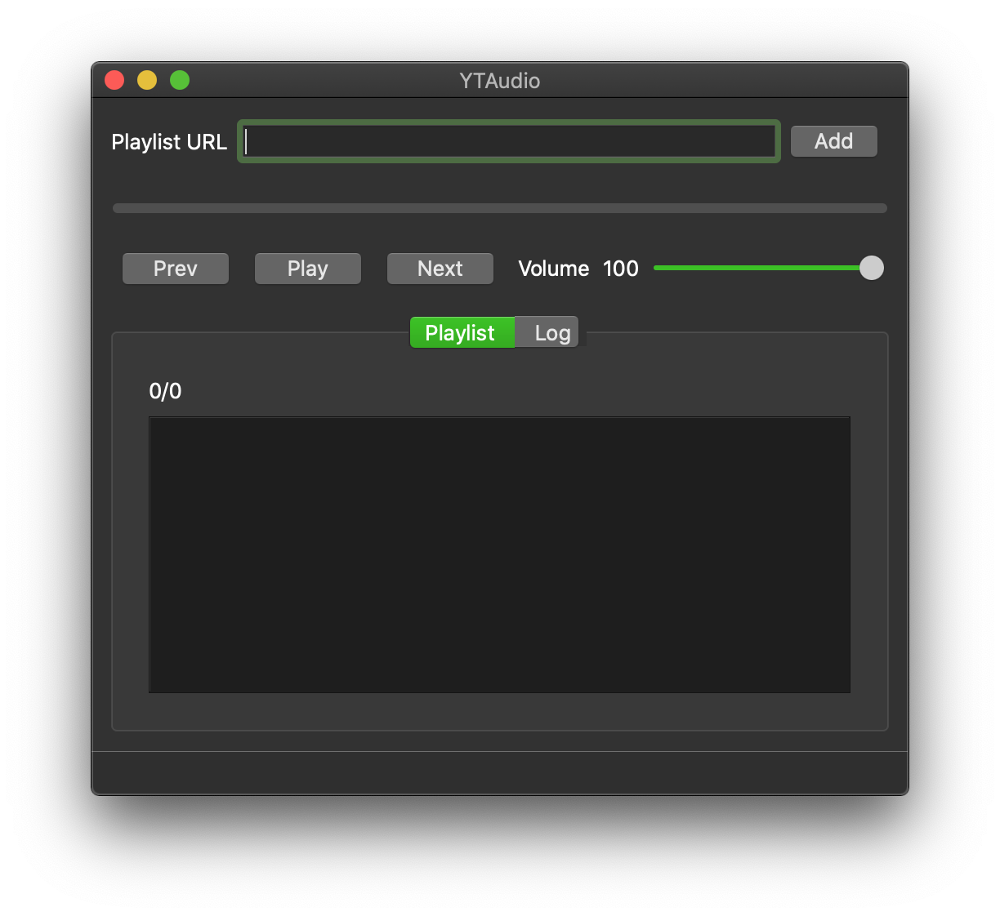

# ytaudio
Only play audio form all videos in a playlist.

## Dependencies
 * Qt 5.14.2
 * C++ 11
 * python 3.7+
    * requests

## Build

  ```
your_paht/ytaudio$mkdir build && cd build
your_paht/ytaudio/build$cmake ..
your_paht/ytaudio/build$make
  ```

## Run
Open exeutable file `ytaudio`.

The playlist url must contain `list` field and be valid to play video in a webbrowser.

URL example : `https://www.youtube.com/watch?v=83xBPCw5hh4&list=RDCLAK5uy_kmPRjHDECIcuVwnKsx2Ng7fyNgFKWNJFs`

## Screenshot


## License
[MIT](https://choosealicense.com/licenses/mit/)
